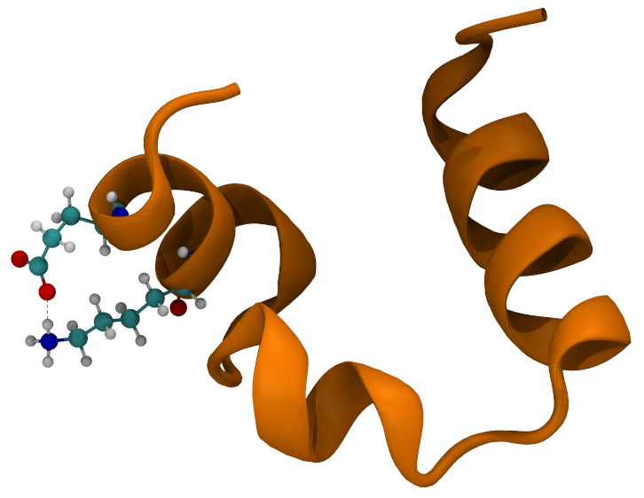

# Visualization

## 1. nglview, VMD and PyMOL
In the previous notebooks, a relatively basic visualization of intermediate results was done with [nglview](http://nglviewer.org/nglview/latest/index.html). While nglview is convenient for a quick introspection inside a notebook, it only offers a fairly simple customization of the visual representation through its [Python API](http://nglviewer.org/nglview/latest/api.html).

More advanced biomolecular visualization tools are available, of which [VMD](http://www.ks.uiuc.edu/Research/vmd/) and [PyMOL](https://pymol.org/2/) are popular choices. Both tools are comparable in functionality  (but obviously differ when going through the details). A major difference in practice is the distribution of both codes. VMD is free as in free beer, but not open source. One can download binaries and source code from its homepage. PyMol is in principle an open-source project, but binary packages (with several commercial enhancements) are sold for a mild price. For this tutorial, we will use VMD, so you can get you started without having to pay for a license.

## 2. Walk-through for VMD + good practices

This tutorial will show you how to make the following visualization of the final structure of the Villin headpiece molecular dynamics simulation:



Note that the final geometry may be slightly different due to the random initialization of the atomic velocities. In any case, try to reproduce this image as well as possible. The instructions are based on good practices for making high-resolution publication-ready visualizations.

### Activate the right conda environment

In the introductory part of this tutorial, VMD was installed in a separate conda environment because it would otherwise interfere with Jupyter. Hence, we first need to switch to the correct conda environment:

```bash
conda activate vmd
```

### Open the trajectory in VMD

The easiest way to load a trajectory in VMD, is to provide the topology and trajectory inputs on the command line:

```bash
cd ../04_protein/
vmd init.pdb traj.dcd
```

After VMD has started, play the video (play button in the bottom-right of the main window) or skip to the last frame immediately. The default representation is not particularly clear or insightful. This choice is mainly motivated by the computational efficiency with which VMD can draw a lot of simple lines.

### Change to the "NewCartoon" representation

In the main window, select the menu function `Graphics` -> `Representations...` and change the `Drawing Method` to `NewCartoon` and change `Selected Atoms` to `protein`. This will discard the water molecules and show the familiar cartoon with three curls for the alpha helices.

You can recenter the view on the visible parts by selecting the menu option `Display` -> `Reset view`.

### All-atom visualization of a subsystem

Now add a new representation in the `Representations` window, by clicking on `Create Rep`. This will duplicate the currently selected representation, hence not showing any differences until you start modifying the new representation.

Set the `Drawing Method` to `CPK` and change the `Selected Atoms` to `protein and (resid 4 or resid 7)`. This will only show all atoms of two residues whose side-chains interact electrostatically.

Finally, add a third drawing method and use the `Drawing Method`  option `HBonds`.

An overview of the VMD atom selection language can be found here: http://www.ks.uiuc.edu/Research/vmd/vmd-1.3/ug/node132.html

### Remove clutter and make the image print-friendly

- Get rid of the frame axes (because it is fairly useless): select in the menu `Display` -> `Axes` -> `Off`.
- Set the project to orthographic, unless you enjoy skewed perspective images: select in the menu `Display` -> `Orthographic`.
- Change the background color to white (to save ink and to improve clarity): select in the menu `Graphics` -> `Colors`. In the `Color Controls` window, select `Display` and change `BackgroundTop` and `BackgroundBot` to `8 white`. Also select in the menu: `Display` -> `Background` -> `Gradient`. This way, depth cueing uses dark shades while the background is white.
- Change the curly cartoon color to something distinct from the color of the carbon atoms: in the `Graphical Representation` window, select the `NewCartoon` representation. Then select for `Coloring Method` the option `ColorID` and set the color to `3 orange`.
- Finally rotate the visual to clearly view the interacting side chains without hiding the essential parts of the protein. Also zoom in to efficiently use the display size.

### Enable ambient occlusion

[Ambient Occlusion](https://en.wikipedia.org/wiki/Ambient_occlusion) is a 3D visualization technique that clarifies the shape of complex geometries by simulating realistic ambient lighting effects. Parts of a model buried inside will become darker as the simulated light cannot easily reach such places. For a small protein like the Villin headpiece, this will have little effect, mainly visible inside alpha helices. For larger systems, ambient occlusion has a major beneficial effect.

To enable ambient occlusion in VMD, several options need to be switched on. Keep in mind that you will only see the result in the next step and the visualization may at first look even worse.

- Go through each representation and set the `Material` to `AOShiny`.
- In the menu `Display` -> `Display options`. In the `Display Settings` window, under `Ray Tracing Options`, enable `Shadows` and `Amb. Occl.`.

### Ray-trace the image with Tachyon

Ray-tracing is an (expensive) 3D visualization technique to generate more realistic-looking images. Usually, such images are visually clearer. An additional advantage is that the image resolution can be easily controlled.

The first step is to select the menu option `File` -> `Render`. In the `File Render Controls` window, select the `Tachyon` option and click `Start Rendering`. This will render a the scene of interest, which takes a few seconds. The image is stored on disk as `vmdscene.dat.tga`. At the same time, also the scene file is written: `vmdscene.dat`. This file can be edited to adapt the resolution and to change other settings. After modifying the scene file, you can re-render by running the following command in a terminal:

```bash
${CONDA_PREFIX}/lib/tachyon_LINUXAMD64 vmdscene.dat -format TARGA -o vmdscene.dat.tga
```

This should work on Linux and MacOS. A slightly different command may be needed on Windows.
